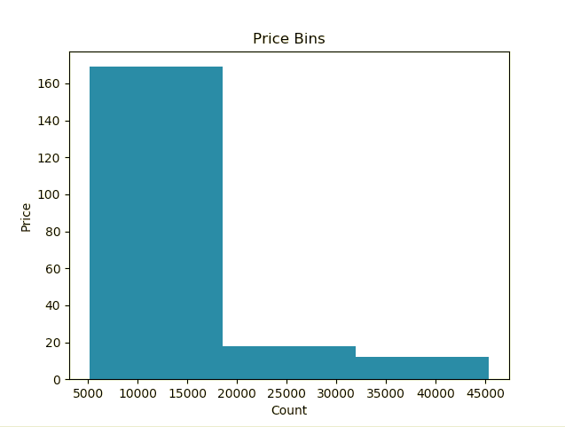
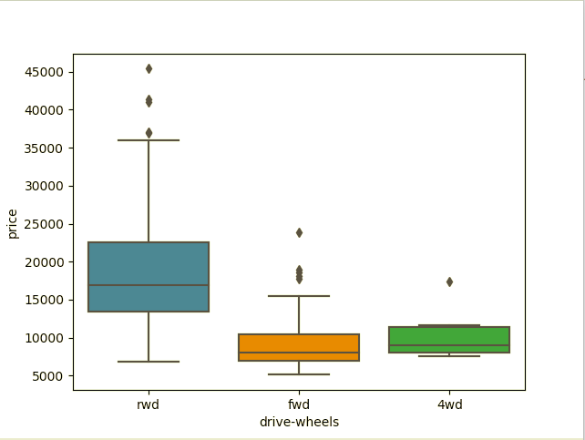
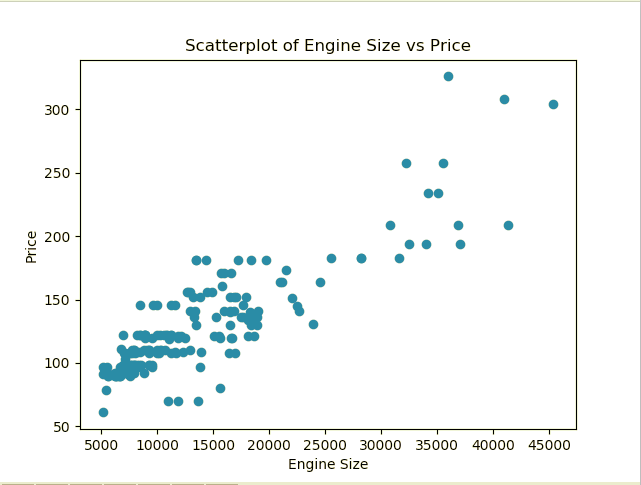
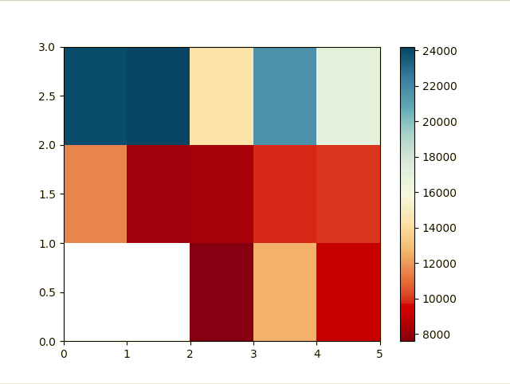
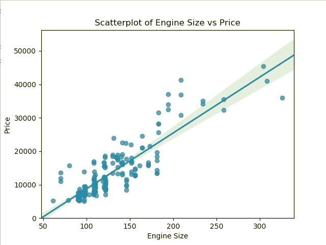
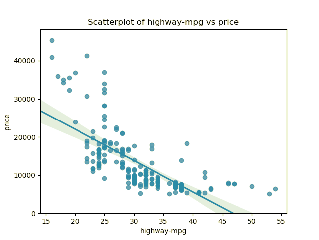
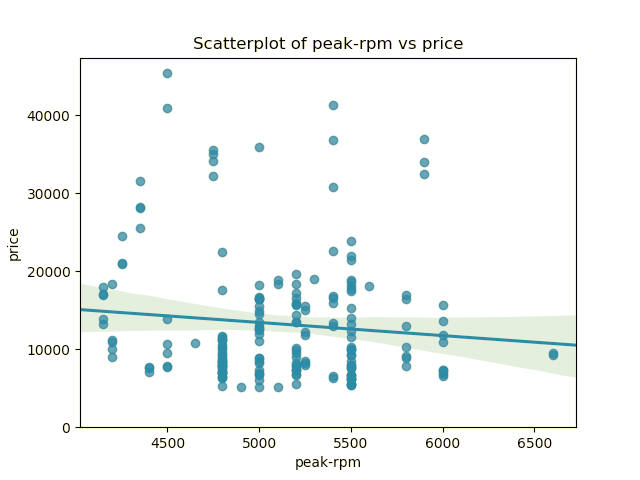
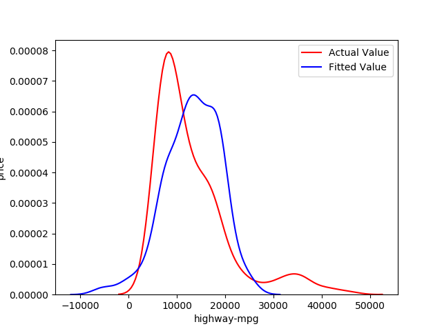
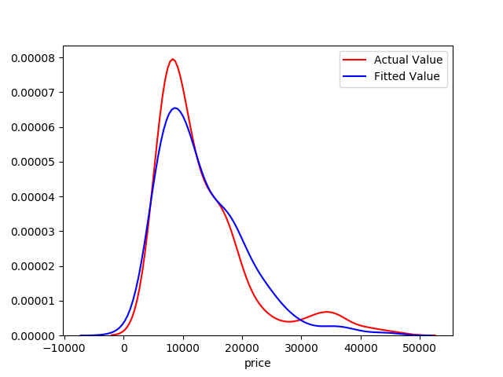

# automobile-data-set-analysis

## Data Analysis and Prediction of Car Prices based on used car prices data set.
In this project I'm trying to analyze and visualize the used car prices from
the dataset available at https://archive.ics.uci.edu/ml/machine-learning-databases/autos/

I'm planning to divide it in four parts:
1) Data Wrangling
	-pre processing data in python
	-dealing missing values
	-data formatting
	-data normalization
	-binning
2) Exploratory Data Analysis
	-descriptive statistics
	-groupby
	-analysis of variance
	-correlation
	-correlation stats
3) Model Development
	- Simple Linear Regression
	- Multiple Linear Regression
4) Model Evaluation
	- Rgression Plots
	- Distribution Plots

## Description:

	  This data set consists of three types of entities: (a) the
      specification of an auto in terms of various characteristics, (b)
      its assigned insurance risk rating, (c) its normalized losses in use
      as compared to other cars.  The second rating corresponds to the
      degree to which the auto is more risky than its price indicates.
      Cars are initially assigned a risk factor symbol associated with its
      price.   Then, if it is more risky (or less), this symbol is
      adjusted by moving it up (or down) the scale.  Actuarians call this
      process "symboling".  A value of +3 indicates that the auto is
      risky, -3 that it is probably pretty safe.

      The third factor is the relative average loss payment per insured
      vehicle year.  This value is normalized for all autos within a
      particular size classification (two-door small, station wagons,
      sports/speciality, etc...), and represents the average loss per car
      per year.

## Importing the Modules:

	  import pandas as pd
	  import numpy as np
	  import math
	  import matplotlib.pyplot as plt
	  import seaborn as sns

## Analysis

1) Histograms representing Binned prices in Low, Medium, High

2) Boxplots representing effect of wheel frive with prices.

3) Scatter plot for Prices over Engine size

4) Pivot table categorizing wheel drive and body style with prices.

5) HeatMap with wheel drive in y axis and body style in x axis.

6) Positive Linear Relationship between engine size and price

7) Negetive Linear Relationship between highway-mpg and price

8) Weak Correlation between peak-rpm and price

9) Simple Linear Regression plot

10) Multiple Linear Regression plot

## Conclusion

**Yet to be updated**
